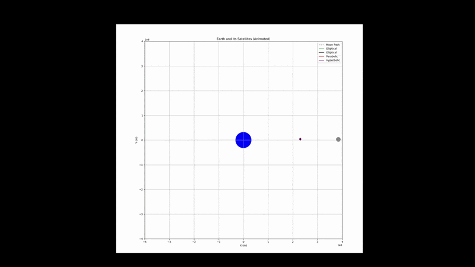
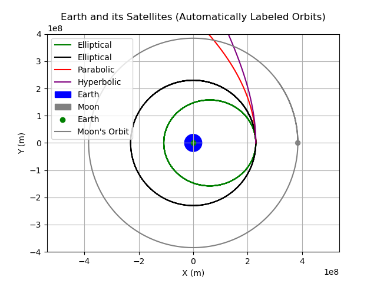
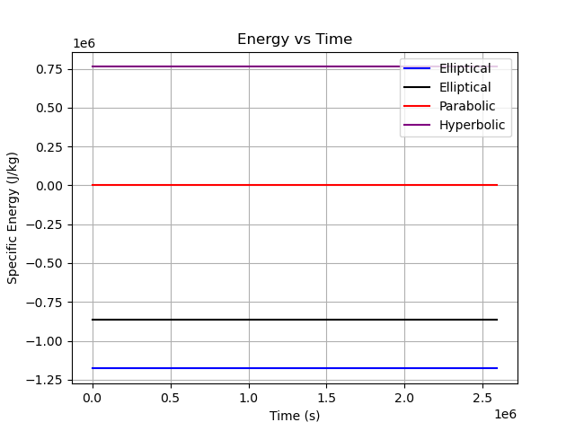
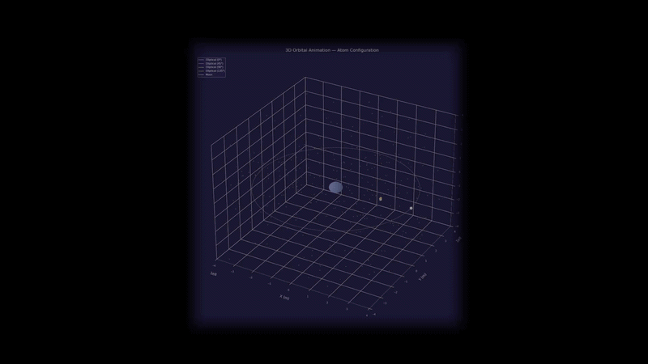
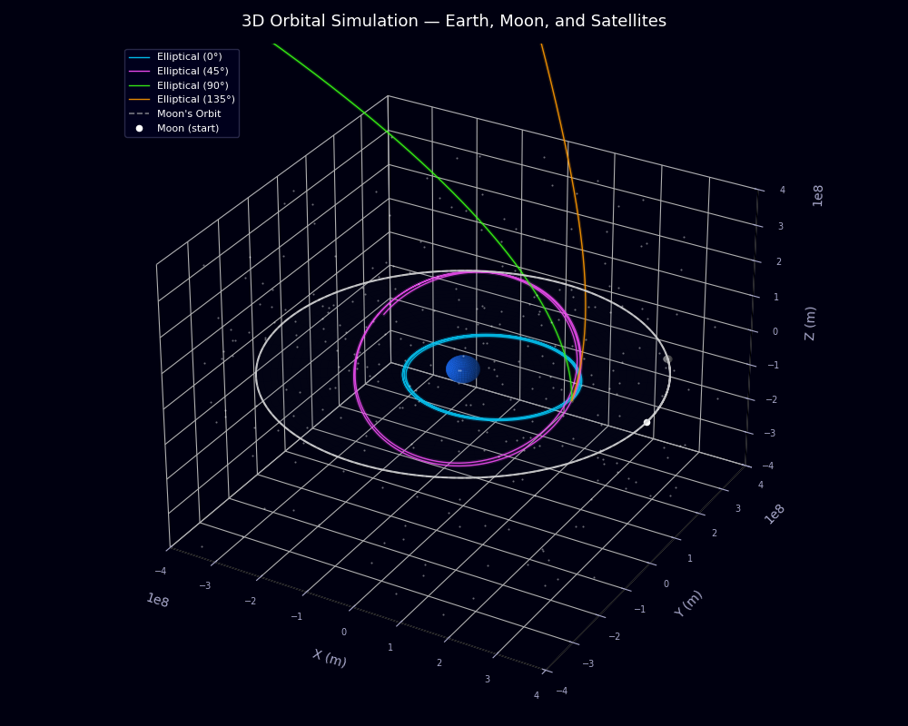
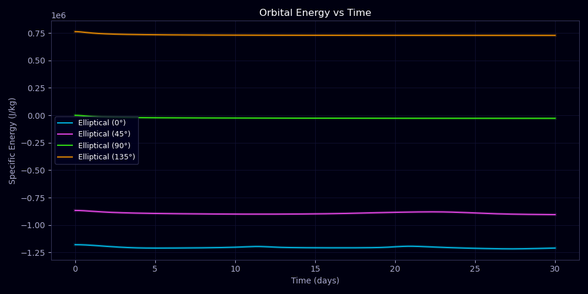

# 🛰️ Orbital Mechanics Simulation Series

> Numerical simulation of satellites orbiting Earth using Newtonian gravity and SciPy ODE solvers.

Download each part folder separately and trace the progression yourself — then personalise your own simulation by tweaking the initial conditions in `main.py`!

---

## 📌 Overview

This is a multi-part series building a full 3D orbital mechanics simulator from scratch in Python. It models satellites under Newtonian gravity, solves the equations of motion numerically using SciPy, and visualises the results — growing from a single satellite in 2D all the way to a 3-body system with real Moon gravity and inclined 3D orbits.

Each part builds directly on the last. The progression mirrors how real mission simulators are developed: start simple, validate the physics, then add complexity one layer at a time.

---

## ⚙️ How to Run

**Requirements**
```bash
pip install numpy scipy matplotlib
```

**Run any part**
```bash
cd Part1   # or Part2 / Part3
python main.py
```

Each part is self-contained. Running `main.py` will produce all plots and launch the animation automatically.

**Personalise it**

Open `main.py` in any part and change:
- `r0` — starting orbital radius in metres. Try `7000e3` for Low Earth Orbit or `42164e3` for Geostationary
- `t_span` — simulation duration. `(0, 30 * 24 * 3600)` is 30 days
- Inclination angles in Part 3 to arrange the orbital planes however you like

---

## 🔧 Tech Stack

| Tool | Purpose |
|------|---------|
| Python | Core language |
| NumPy | Vector maths and array operations |
| SciPy `solve_ivp` | Numerical ODE integration (DOP853 solver) |
| Matplotlib | 2D/3D plotting and animation |

---

## 📂 Project Structure
├── Part1/          ← Single satellite, 2D orbit, energy conservation proof
├── Part2/          ← 4 orbit types, Perigee & Apogee, Moon visualised
└── Part3/          ← 3D orbits, real Moon gravity, atom-like inclinations, space visuals

---

## 🔭 The Physics

### Newtonian Gravity

Every satellite is accelerated toward Earth according to Newton's law of gravitation:
a = -μ * r̂ / |r|²
Where `μ = GM = 3.986 × 10¹⁴ m³/s²` is Earth's gravitational parameter, `r` is the position vector from Earth's centre to the satellite, and `r̂` is the unit vector in that direction. The acceleration grows as the satellite gets closer (inverse square law) and always points toward Earth.

The state of each satellite is described by 6 numbers at every moment in time — three position components `(x, y, z)` and three velocity components `(vx, vy, vz)`. The simulator evolves these 6 numbers forward through time by integrating Newton's second law.

### Numerical Integration — Why DOP853?

The equations of motion have no general closed-form solution for more than two bodies, so they must be solved numerically. This project uses SciPy's `solve_ivp` with the **DOP853** method — an explicit Runge-Kutta method of order 8 with adaptive step size control.

It was chosen over simpler methods (like RK4) because:
- Orbital simulations require high accuracy over long time spans — small errors accumulate and corrupt the trajectory
- DOP853 adaptively adjusts its internal step size to keep local error below tight tolerances (`rtol=1e-9`, `atol=1e-12`)
- It is significantly more efficient than lower-order methods for smooth problems like orbital motion

### Orbital Energy — The Validation Tool

The specific mechanical energy of a satellite is:
E = ½v² - μ/r

In a pure two-body system, this quantity is exactly conserved — it never changes. This gives a built-in validation check: if the energy plot is a flat line, the integrator is working correctly. If it drifts, the tolerances are too loose.

### The Four Orbit Types

| Orbit Type | Energy | Speed at r₀ | Shape |
|------------|--------|-------------|-------|
| Elliptical | E < 0 | v < v_escape | Closed loop — satellite returns |
| Circular | E < 0 | v = √(μ/r) | Special case of ellipse, constant altitude |
| Parabolic | E = 0 | v = √(2μ/r) | Exactly escape velocity — open, never returns |
| Hyperbolic | E > 0 | v > v_escape | Escapes Earth permanently |

v_circular = √(μ / r)
v_escape   = √(2μ / r) = √2 × v_circular

### Inclination

Orbital inclination is the angle between the orbital plane and Earth's equatorial plane, set by splitting the initial velocity into `vy` and `vz` components:

```python
vy = v * cos(inclination)
vz = v * sin(inclination)
```

At 0° the orbit is equatorial. At 90° it is polar. Part 3 uses 0°, 45°, 90°, and −45° — four planes arranged around Earth like an atom, with Earth at the nucleus.

### Moon Gravity — The N-Body Problem

In Part 3, the Moon's gravity is added as a real force on each satellite. At every timestep the simulator computes the vector from each satellite to the Moon and adds the acceleration:
a_moon = μ_moon × (r_moon - r_sat) / |r_moon - r_sat|³

Where `μ_moon = 4.905 × 10¹² m³/s²`. This turns the simulation from a two-body problem into a three-body problem with no analytical solution. The Moon continuously adds and removes energy from each orbit — visible as oscillations in the energy plot every ~27 days.

---

## 🌍 Why This Matters — Real Satellite Dynamics

Real satellites are constantly perturbed by:

- 🌕 **The Moon** — the dominant perturbation after Earth, modelled in Part 3
- ☀️ **The Sun** — especially significant for high-altitude orbits (GEO, L2 missions)
- 🌐 **Earth's oblateness (J2 effect)** — Earth's equatorial bulge causes slow orbital precession
- ☀️ **Solar radiation pressure** — photons exert a tiny but cumulative force
- 🪐 **Third-body effects from other planets** — measurable over years for deep space missions

These perturbations compound over months and years. Without regular station-keeping burns, satellites drift off course entirely. For GPS — which requires nanosecond timing precision — or JWST at L2 with no possibility of servicing, n-body dynamics are not a footnote. They are the central engineering problem.

This is exactly why real mission simulators use numerical propagation, just like this project, rather than analytical formulas.

---

## 🚀 Parts

---

### Part 1 — Single Satellite, Two-Body Problem

The path a satellite takes at radius `r` from Earth. The flat energy plot proves the simulation is physically correct.


**What it does:**
- Propagates a single satellite around Earth using `solve_ivp`
- Plots the 2D orbital path
- Validates physics via energy conservation — a flat line confirms the integrator is accurate

**Design decision:** Starting with one satellite and one force lets you isolate and validate the core physics before adding complexity. If energy isn't conserved here, nothing in Parts 2 or 3 can be trusted.

---

### Part 2 — Four Orbit Types, Perigee & Apogee

4 orbit types simulated simultaneously. Perigee and Apogee computed and printed for each. Moon orbit visualised.





**What it does:**
- Simulates 4 satellites from the same starting radius `r0` at different speeds:
  - 🔵 **Elliptical** — `0.8 × v_circular`
  - ⚫ **Circular** — `v_circular`
  - 🔴 **Parabolic** — `v_escape`
  - 🟣 **Hyperbolic** — `1.2 × v_escape`
- Automatically classifies orbit type from the sign of orbital energy
- Computes Perigee (closest approach to Earth) and Apogee (furthest point)
- Visualises the Moon's orbital path

**Try it:** Change `r0` in `main.py` and watch how perigee and apogee values change.

**Simulation duration:** 30 days

---

### Part 3 — 3D Orbits, Moon Gravity, Atom Configuration

Full 3D simulation with real Moon gravity, inclined orbital planes, and space-themed visuals.





**What it does:**
- Full 3D orbits with each satellite in a different plane:
  - Sat 1 — 0° equatorial
  - Sat 2 — 45°
  - Sat 3 — 90° polar
  - Sat 4 — −45° retrograde plane
- 4 planes arranged symmetrically like an atom — Earth at the nucleus, orbits like electron shells
- Moon gravity added as a real physical force — not just visual
- Energy plot shows ~27-day oscillations from Moon perturbation
- Space-themed animation: dark background, neon glowing trails, star field, Earth and Moon as spheres

**Design decision:** The hyperbolic satellite uses −45° rather than 135°. At 135°, `cos(135°)` is negative — part of the velocity points back toward Earth, swinging the satellite dangerously close to the surface before it escapes. At −45° the velocity is fully outward and the starting point is the periapsis by definition, guaranteeing a safe trajectory.

---

## 📈 Outputs

| Output | Description |
|--------|-------------|
| Orbit plot | Satellite paths around Earth (2D or 3D) |
| Energy plot | Specific mechanical energy over time |
| Animation | Real-time orbital animation with Moon |
| Terminal | Perigee & Apogee printed per satellite |

---

# NEXT STEPS?
- Add the involvement of the sun and see what changes occur
- The need for burns for satellite path correction **Hohmann transfer manoeuvre**
---

*Built with Python · NumPy · SciPy · Matplotlib*
