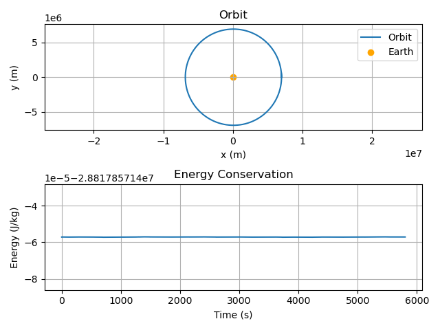

# orbital-mechanics-simulation-series
Numerical simulation of a satellite orbiting Earth using Newtonian gravity and SciPy ODE solvers (Part of an orbital mechanics series).

## Overview
This project is a series of numerical simulations of a satellite/s orbiting Earth under Newtonian gravity.

It solves the two-body problem using `solve_ivp` from SciPy.

## Features
- Newtonian gravitational model
- Numerical integration (DOP853 solver)
- 2D orbit visualization
- Energy conservation analysis
- 3D Orbit visualization
- N body problem
- Moon gravity effect??

## Output
- Satellite orbit around Earth
- Specific mechanical energy over time
- Orbital Animation
- Different forms of orbit and Moon orbit

## Tech Stack
- Python
- NumPy
- SciPy
- Matplotlib

## Note
This is Part 1 of a larger orbital mechanics simulation series, part 2 will later include:
- multiple orbital regimes
- improved visuals and animation
- Moon trajectory
-improved simulation structure

# Orbital Mechanics Simulation — Part 1

# Orbital Mechanics Simulation — Part 2

